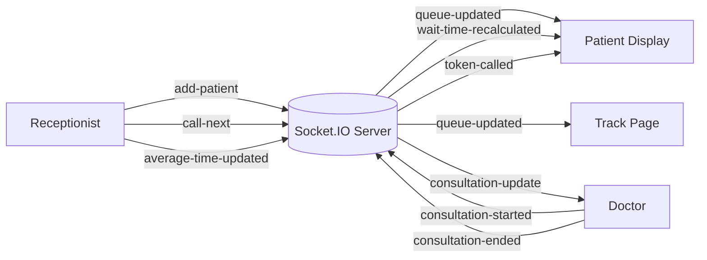

# Socket Event Architecture

Event groups:

- `add-patient`, `call-next`, `average-time-updated` all broadcast `queue-updated`
- `consultation-started` and `consultation-ended` broadcast `consultation-update`
- `average-time-updated` also broadcasts `wait-time-recalculated`